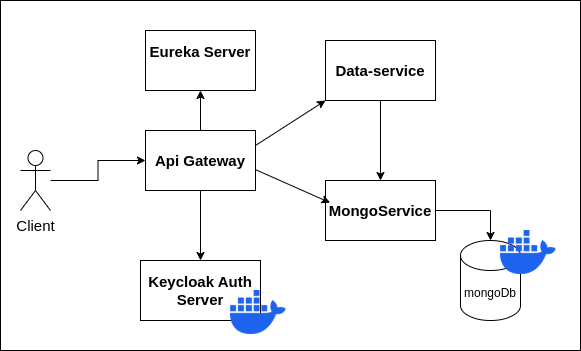
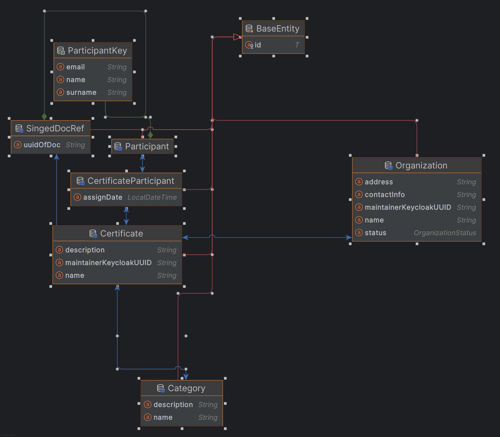

Certificate Management System
===========================

A comprehensive digital certificate management solution for educational institutions, training centers, and organizations. Built with microservices architecture, it enables secure creation, signing, and verification of certificates.

Getting Started
-------------

1. Clone repository: ```git clone git@github.com:Pulladium/EdCertificationSystem.git```

2. Start infrastructure: In root folder run ```docker-compose up -d```

3. Configure Keycloak:
   * Access: http://localhost:8484/admin  username: admin, password:admin_password
   * Go to: Create realm.
   * Drag or browse [keycloak-realm-configuration.json](./keycloak-realm-configuration.json) into resource file field 
   * Import configuration
   * Go to Users -> Add user
   * create 2 users

   Admin User
   1. enter Username: meinadm
   2. Choose Email verified == true
   3. Click Create
   4. Go to Credentianls -> Set password (postman conf with "admin_password") -> Set Temporary == false
   5. Go to Role mappping -> Assign role -> choose admin and registered-user

   Registered User
   1. enter Username: simpleUser
   2. Choose Email verified == true
   3. Click Create
   4. Go to Credentianls -> Set password (postman conf with "user_password") -> Set Temporary == false
   5. Go to Role mappping -> Assign role -> choose registered-user
    

4. Run Spring Boot Services
   * ```cd eureka-server/``` ```mvn spring-boot:run```
   * ```cd gateway-react/``` ```mvn spring-boot:run```
   * ```cd data-service-mvc/``` ```mvn spring-boot:run```
   * ```cd  mongo-data-service/``` ```mvn spring-boot:run```

5. Run Client(Postman recomended)
   1. Run React.js(not fishied) --```cd EdCertificationSysFront/``` , ```npm install``` , ```npm start```
   2. Use Postman api
      * import testing Collection from [postmanCollection.json](./CertificatOnline.postman_collection.json)
      * to start scenario go to scenario collection (for ex. CreateCertAndGenerateDocScenario)
      * go to Authorization menu and Click Get New Access Token -> Proceed -> Use Token
      (by default client secret is "**********") it can be changed via keycloak admin console -> clients ->postman-certedu-api->credentials
      * Next Click Run near the collection name

System Architecture
------------------

*Microservices interaction and communication flow*


Data Model
----------


*Persistence entity relationships*

Technology Stack
--------------

* **Backend Services**
  * Java 17+
  * Spring Boot 3.3.2
  * Spring Cloud 2023.0.3
  * Spring Security with OAuth2

* **Storage**
  * H2/PostgreSQL - Main database
  * MongoDB with GridFS - Document storage
  * P12 Keystores - Security keys

* **Security**
  * Keycloak 22.0.1
  * ED25519 Digital Signatures
  * OAuth2/OpenID Connect

* **Infrastructure**
  * Docker
  * Eureka Server
  * Spring Cloud Gateway

Technical Experience and Challenges
---------------------------------

Key Technologies and Decisions:

* Chose RestTemplate over Feign Client because:
  * Feign is being deprecated
  * RestTemplate provides better control over HTTP requests
  * More straightforward error handling

* Security Implementation:
  * Implemented Keycloak OAuth2 instead of basic Spring Security
  * Provides better user management
  * Supports SSO and token-based authentication
  * More scalable for microservices architecture

* Document Generation:
  * Used Flying Saucer (open-source) for PDF generation
  * Integrated Thymeleaf for dynamic HTML templates
  * Implemented GridFS for efficient PDF storage in MongoDB

* Testing and Development:
  * Mastered Postman scripting for automated API testing
  * Created comprehensive test scenarios

Planned but Not Implemented:
* Asynchronous communication between services using Kafka
* Would improve system scalability and reduce coupling

Main Challenge:
Time management was the biggest obstacle - underestimated the complexity of integrating multiple technologies and implementing proper security measures.
